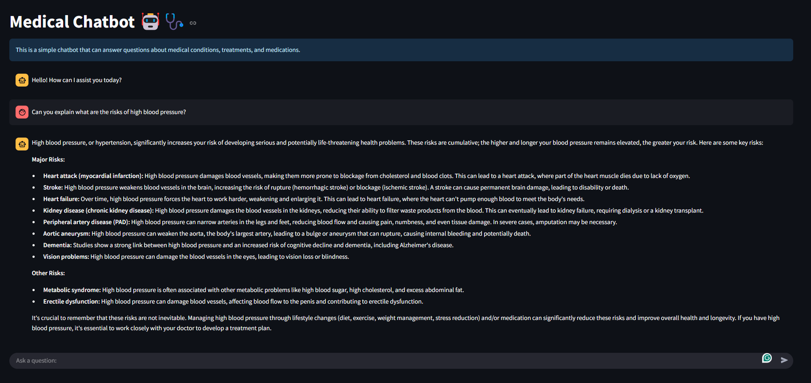
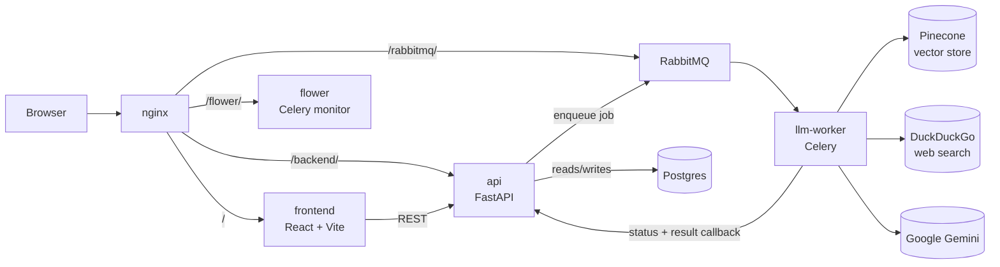
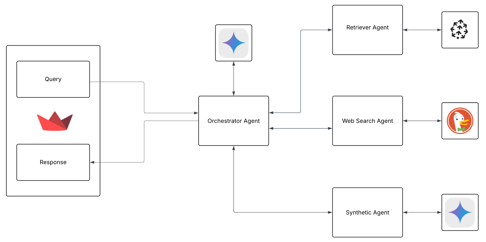

# Medical Chatbot

A production-oriented, RAG-powered medical chatbot built as a containerized monorepo of microservices. A multi-agent pipeline (retrieval + live web search + synthesis) answers medical questions grounded in real medical literature, processed asynchronously behind a message queue so the API never blocks on the LLM.



> This project started as a single-script Streamlit prototype for a class project and is being rebuilt into a production-grade application — this README documents the first milestone of that rebuild: a working, containerized, async, multi-service architecture with session management.

## Overview

- Ask a medical question → the backend enqueues the work and returns instantly with a job id.
- A Celery worker picks up the job, runs a **LangGraph** multi-agent pipeline that decides whether to search the internal medical knowledge base (Pinecone), the live web (DuckDuckGo), or both, then synthesizes an answer with **Google Gemini**.
- The result is written back to Postgres and picked up by the frontend, which polls for new messages.
- Conversations are grouped into sessions you can rename or delete from the sidebar.

## Architecture

The system is a set of independently deployable services, all defined in one repo (`infra/compose.yml`) and fronted by Nginx:



**Request flow:** the frontend posts a message to the API, which persists it, creates a `Job` row (`queued`), and hands it to Celery over RabbitMQ — responding immediately with the `job_id`. The `llm-worker` service consumes the job, marks it `processing`, runs the agent graph below, then calls back into the API to persist the assistant's reply and flip the job to `success`/`failed`. The frontend has no direct line to the worker; it only ever talks to the API and finds out about new messages by polling.

**Multi-agent RAG pipeline** (inside `llm-worker`, orchestrated with LangGraph):



1. **Router** — an LLM call classifies the query as needing the knowledge base or a live web search.
2. **Retrieval Agent** — searches a Pinecone index built from *Encyclopedia of Medicine* (chunked, embedded with `sentence-transformers/all-MiniLM-L6-v2`) and scores relevance.
3. **Web Search Agent** — falls back to DuckDuckGo for queries outside the knowledge base.
4. **Synthesis Agent** — merges whatever context was retrieved and calls Gemini 2.5 Flash to produce the final answer.

## Tech Stack

| Layer | Technology |
|---|---|
| Frontend | React 19, Vite, TypeScript, TanStack Query, Tailwind CSS, Radix/shadcn components |
| Backend API | FastAPI, SQLAlchemy, Alembic, PostgreSQL, Celery (producer) |
| LLM Worker | Celery, LangGraph, LangChain, Google Gemini 2.5 Flash, Pinecone, HuggingFace sentence-transformers, DuckDuckGo Search |
| Infra | Docker Compose, Nginx, RabbitMQ, Flower |

## Project Structure

```
Medical-Chatbot/
├── frontend/            # React SPA (chat UI, sessions sidebar)
├── services/
│   ├── api/              # FastAPI backend — sessions, chat, jobs
│   └── llm-worker/       # Celery worker — multi-agent RAG pipeline
├── infra/                # docker-compose.yml, nginx.conf, rabbitmq.conf
├── data/                 # source medical literature (PDF) for the knowledge base
├── docs/                 # architecture diagrams, methodology notes
├── dev.sh                # local dev entrypoint (wraps docker compose)
└── .env                  # shared secrets/config (not committed)
```

## Getting Started

### Prerequisites

- Docker and Docker Compose
- A [Pinecone](https://www.pinecone.io/) API key
- A [Google AI Studio](https://aistudio.google.com/) API key (Gemini)

### Environment variables

Create a `.env` in the repo root:

```env
PINECONE_API_KEY=
GOOGLE_API_KEY=

POSTGRES_HOST=db
POSTGRES_PORT=5432
POSTGRES_USER=
POSTGRES_PASSWORD=
POSTGRES_DB=

BROKER_URL=amqp://<rabbitmq_user>:<rabbitmq_pass>@rabbitmq:5672//
BACKEND_URL=http://api:8000/api/v1

RABBITMQ_DEFAULT_USER=
RABBITMQ_DEFAULT_PASS=
```

And a `frontend/.env`:

```env
VITE_BASE_URL="http://127.0.0.1/backend/api/v1"
```

### Running

`dev.sh` wraps Docker Compose so you don't have to remember flags or paths:

```bash
./dev.sh up      # build + start everything, logs attached
./dev.sh upd     # same, detached
./dev.sh logs    # tail logs (optionally: ./dev.sh logs llm-worker)
./dev.sh ps      # service status
./dev.sh down    # stop everything
```

Once running, everything is served through Nginx on port 80:

| URL | Service |
|---|---|
| `http://localhost/` | Frontend |
| `http://localhost/backend/api/v1/` | Backend API |
| `http://localhost/flower/` | Celery task monitor |
| `http://localhost/rabbitmq/` | RabbitMQ management UI |

Code changes are picked up live for `api` (uvicorn `--reload`) and `frontend` (Vite HMR) thanks to bind-mounted volumes. `llm-worker` does **not** auto-reload — restart it after changing agent/orchestrator code:

```bash
./dev.sh restart llm-worker
```

### Populating the knowledge base

Before asking questions for the first time, build the Pinecone index from the medical PDFs in `data/`:

```bash
./dev.sh sh llm-worker
python store_index.py
```

This only needs to be run once (or again if you change the source documents).

## API Reference

All routes are prefixed with `/api/v1`.

| Method | Path | Description |
|---|---|---|
| `GET` | `/sessions/` | List all sessions |
| `GET` | `/sessions/{id}/conversations` | List messages in a session |
| `PUT` | `/sessions/{id}/rename` | Rename a session |
| `DELETE` | `/sessions/{id}` | Delete a session |
| `POST` | `/chat/ask` | Start a new session with a message → returns `job_id` |
| `POST` | `/chat/ask/{session_id}` | Send a message in an existing session → returns `job_id` |
| `GET` | `/jobs/{job_id}` | Get a job's status/result |
| `PATCH` | `/jobs/job-status-change/{job_id}/{status}` | *Internal* — used by `llm-worker` to update job status |
| `POST` | `/jobs/add-conversation/{session_id}/{job_id}/{status}` | *Internal* — used by `llm-worker` to write back the result |

## Roadmap / Known Limitations

This milestone covers the async pipeline end-to-end (submit → queue → multi-agent processing → callback → poll) plus session management. Deliberately out of scope for now, planned next:

- **Job status in the UI** — the frontend currently only polls for new messages; it doesn't yet show a "thinking…" state while a job is `processing`, or surface a distinct error state when a job `fails` (this needs backend support — e.g. exposing job status per session — before the UI work makes sense).
- **WebSockets** — polling is a deliberate first step; the plan is to replace it with a push-based update once the job-status work above lands.
- **Automated tests / CI** — none yet.
- **Production Dockerfiles** — current images are dev-oriented (bind mounts, hot reload); no hardened/multi-stage prod build yet.

## License

MIT — see [LICENSE](LICENSE).

## Contributors

- [@sujanW0W](https://github.com/sujanW0W)

## Contact

Sujan Maharjan — [sujan.maharjan.1@ndsu.edu](mailto:sujan.maharjan.1@ndsu.edu)
