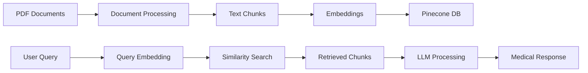

### Project Overview: Medical Chatbot

A RAG (Retrieval Augmented Generation) based medical chatbot that provides medical information based on user queries by leveraging medical literature.

### Key Components and Technologies

1. **Document Processing**

    - **PyPDFLoader & DirectoryLoader**: Used to extract text from medical PDF documents
    - **RecursiveCharacterTextSplitter**: Splits documents into smaller chunks (500 characters with 20 character overlap) for better processing

2. **Embedding Generation**

    - **Model**: sentence-transformers/all-MiniLM-L6-v2 (via HuggingFaceEmbeddings)
    - **Purpose**: Converts text chunks into 384-dimensional vector representations
    - **Advantage**: Enables semantic search and similarity matching

3. **Vector Database**

    - **Platform**: Pinecone
    - **Features**:
        - Serverless architecture on AWS
        - Cosine similarity metric for vector matching
        - Efficient indexing and retrieval
        - Stores vector embeddings of text chunks

4. **Retrieval System**

    - **Method**: Similarity-based search
    - **Configuration**: k=3 (retrieves top 3 most relevant documents)
    - Uses PineconeVectorStore's retriever functionality

5. **Language Model**

    - **Model**: Google's Gemini 1.5 Flash
    - **Integration**: Via LangChain's ChatGoogleGenerativeAI

6. **LangChain Chains**
    - **Components**:
        - `create_stuff_documents_chain`: Combines retrieved documents with the prompt
        - `create_retrieval_chain`: Links retriever with question-answering chain
        - Custom system prompt for medical context

### Workflow

1. **Data Ingestion**:

    ```
    PDF Documents → Text Extraction → Chunk Creation
    ```

2. **Embedding Process**:

    ```
    Text Chunks → Vector Embeddings → Pinecone Database
    ```

3. **Query Processing**:

    ```
    User Query → Vector Embedding → Similarity Search → Relevant Chunks Retrieval
    ```

4. **Response Generation**:
    ```
    Retrieved Chunks + User Query → LLM Processing → Medical Response
    ```

### Key Features

-   Context-aware responses based on medical literature
-   Efficient retrieval through vector similarity search
-   Scalable architecture using serverless database
-   Professional medical context maintenance through system prompts
-   Responsible AI implementation with medical disclaimer

This architecture ensures accurate, literature-based medical information retrieval while maintaining efficiency and scalability. The system combines the power of modern language models with reliable medical knowledge sources.

## Explanation of Components

I'll break down each component and explain its significance in the medical chatbot pipeline.

### 1. Document Processing Components

**PyPDFLoader & DirectoryLoader**

-   **Purpose**: Extracts text content from PDF medical documents
-   **Significance**:
    -   Handles multiple PDF files in a directory
    -   Maintains document structure and metadata
    -   Enables processing of large medical literature databases
-   **Role**: Forms the initial data ingestion layer of the pipeline

**RecursiveCharacterTextSplitter**

-   **Purpose**: Breaks down large texts into manageable chunks
-   **Significance**:
    -   Chunk size (500 chars) ensures context preservation
    -   Overlap (20 chars) maintains continuity between chunks
    -   Prevents token limit issues in later stages
-   **Role**: Prepares text for efficient embedding and retrieval

### 2. Embedding Layer

**HuggingFaceEmbeddings with sentence-transformers**

-   **Purpose**: Converts text chunks into numerical vectors
-   **Model**: "sentence-transformers/all-MiniLM-L6-v2"
-   **Significance**:
    -   Creates 384-dimensional semantic representations
    -   Captures meaning and context of medical text
    -   Enables semantic similarity comparisons
-   **Role**: Bridges text data and vector database

### 3. Vector Database (Pinecone)

**Pinecone Vector Store**

-   **Purpose**: Stores and indexes vector embeddings
-   **Significance**:
    -   Serverless architecture ensures scalability
    -   Cosine similarity enables semantic search
    -   Fast retrieval of relevant information
-   **Configuration**:
    ```python
    dimension=384
    metric="cosine"
    spec=ServerlessSpec(cloud="aws", region="us-east-1")
    ```
-   **Role**: Acts as the knowledge base for the chatbot

### 4. Retrieval System

**Similarity-based Retriever**

-   **Purpose**: Finds relevant documents for user queries
-   **Configuration**:
    ```python
    retriever = doc_store.as_retriever(
        search_type="similarity",
        search_kwargs={"k": 3}
    )
    ```
-   **Significance**:
    -   Returns top 3 most relevant chunks
    -   Ensures comprehensive context for LLM
    -   Balances between precision and recall
-   **Role**: Connects user queries to stored knowledge

### 5. Language Model Integration

**Google's Gemini 1.5 Flash**

-   **Purpose**: Generates human-like medical responses
-   **Integration**:
    ```python
    llm = ChatGoogleGenerativeAI(model="gemini-1.5-flash")
    ```
-   **Significance**:
    -   State-of-the-art language understanding
    -   Medical context awareness
    -   Natural response generation
-   **Role**: Processes retrieved information into coherent answers

### 6. LangChain Chains

**Document Chain**

```python
question_answer_chain = create_stuff_documents_chain(llm, prompt)
```

-   **Purpose**: Combines documents with prompts
-   **Significance**:
    -   Structures input for LLM
    -   Maintains medical context
    -   Ensures consistent response format

**Retrieval Chain**

```python
rag_chain = create_retrieval_chain(retriever, question_answer_chain)
```

-   **Purpose**: Links retrieval and response generation
-   **Significance**:
    -   Orchestrates the entire RAG process
    -   Maintains workflow consistency
    -   Enables end-to-end query processing

### Pipeline Flow with Components



### Why This Architecture Matters

1. **Scalability**: Components can handle growing medical literature
2. **Accuracy**: Multiple layers ensure reliable information retrieval
3. **Efficiency**: Optimized search and retrieval processes
4. **Maintainability**: Modular design allows component updates
5. **Reliability**: Based on actual medical literature rather than pure LLM knowledge

This architecture ensures that the medical chatbot provides accurate, context-aware responses while maintaining efficiency and scalability. Each component plays a crucial role in transforming raw medical documents into meaningful, accessible information.
